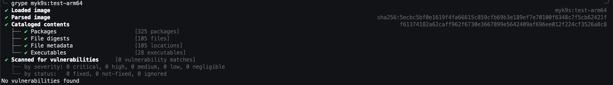
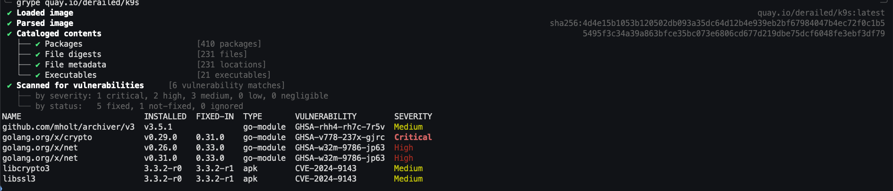

# How to package k9s

This is a simple example of how to package k9s using melange and apko.

## Steps

1. Run the first pipeline to build the package

```bash
docker run --privileged --rm -v "${PWD}":/work --entrypoint=melange --workdir=/work cgr.dev/chainguard/melange build myk9s.yaml --arch aarch64 --signing-key melange.rsa --keyring-append melange.rsa.pub --keyring-append https://packages.wolfi.dev/os/wolfi-signing.rsa.pub --repository-append https://packages.wolfi.dev/os --repository-append /work/packages --empty-workspace
```

2. Run the second pipeline to build the apko

```bash
docker run --rm --workdir /work -v ${PWD}:/work cgr.dev/chainguard/apko build apko.yaml myk9s:test myk9s.tar --arch arm64 --keyring-append melange.rsa.pub --repository-append /work/packages
````

3. Load the image into docker

```bash
docker load -i myk9s.tar
```

4. Run the image

```bash
docker run -it myk9s:test-arm64 version
```

## Scan the image with grype and compare the results with the original image

```bash
grype myk9s:test-arm64
grype quay.io/derailed/k9s
```

## Results

Note that the myk9s image has no vulnerabilities.






